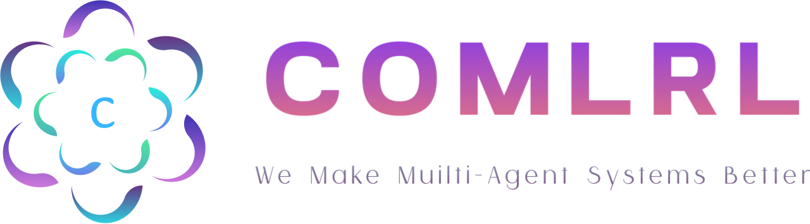
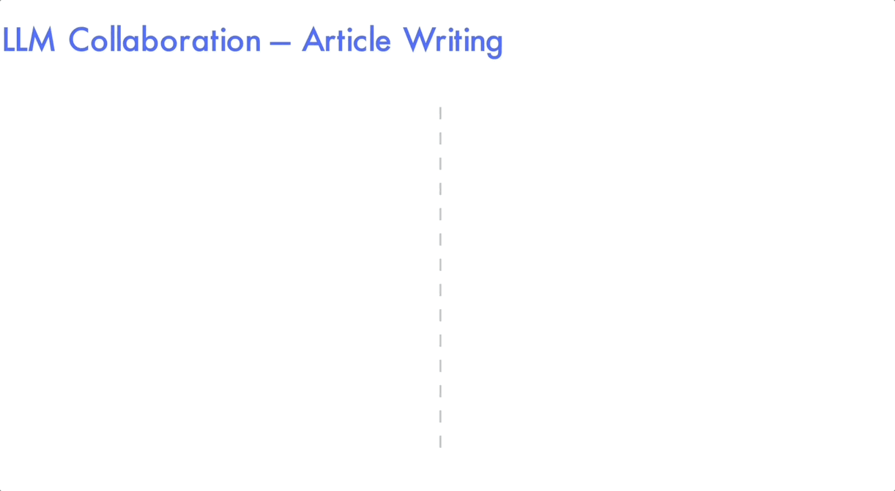

# 

[](https://openmlrl.github.io)
[](https://huggingface.co/CoMLRL)
[](https://arxiv.org/pdf/2508.04652)

[](https://www.python.org/downloads/release/python-3100/)
[](https://github.com/OpenMLRL/CoMLRL/actions/workflows/ci.yml)
[](https://github.com/OpenMLRL/CoMLRL/actions/workflows/pre-commit.yml)
[](https://github.com/psf/black)
[](https://opensource.org/licenses/MIT)

**Co**operative **M**ulti-**L**LM **R**einforcement **L**earning (**CoMLRL**) is a open-source library for training multiple LLMs to collaborate using Multi-Agent Reinforcement Learning (MARL). It provides implementations of various MARL algorithms for LLM collaboration and support for different environments and benchmarks.

## Installation

You can install the stable version of this library from PyPI using pip:

```bash
python3 -m pip install comlrl
```

If you want to use the latest version of CoMLRL, please clone this repository and install it in editable mode:

```bash
cd CoMLRL
pip install -r requirements.txt
pip install -e .
```

<em><sub>Note: Make sure you have a compatible `torch` installed according to the CUDA.</sub></em>

## Features

<ul>
  <li><strong>MARL trainers to optimize LLM collaboration:</strong>
    <ul>
      <li><strong><em>Multi-Agent REINFORCE</em>:</strong> Critic-free policy gradient methods, including
        <a href="https://github.com/OpenMLRL/CoMLRL/blob/main/comlrl/trainers/mareinforce.py">MAREINFROCE</a>,
        <a href="https://github.com/OpenMLRL/CoMLRL/blob/main/comlrl/trainers/magrpo.py">MAGRPO</a>,
        <a href="https://github.com/OpenMLRL/CoMLRL/blob/main/comlrl/trainers/marloo.py">MARLOO</a>,
        <a href="https://github.com/OpenMLRL/CoMLRL/blob/main/comlrl/trainers/maremax.py">MAREMAX</a>.
        <ul>
          <li>Aligned individual response joint with <code>joint_mode='align'</code>.</li>
          <li>Memory-efficient cross joint with <code>joint_mode='cross'</code>.</li>
        </ul>
      </li>
      <li><strong><em>Multi-Agent PPO:</em></strong> Critic-based policy gradient methods, including
        <a href="https://github.com/OpenMLRL/CoMLRL/blob/main/comlrl/trainers/ippo.py">IPPO</a>.
        <ul>
          <li>Canonical IPPO with a separate critic with <code>use_separate_critic=True</code>.</li>
          <li>Memory-efficient critic with value-head over actor with <code>use_separate_critic=False</code>.</li>
        </ul>
      </li>
    </ul>
  </li>
  <li><strong>Environments that simulate real-world tasks for training and evaluating LLM collaboration:</strong>
    <ul>
      <li><a href="https://github.com/OpenMLRL/LLM_Collab_Writing"><strong><em>Writing Collaboration</em></strong></a>: Multiple LLM agents collaborate on processing articles.
        <ul>
          <li><a href="https://huggingface.co/datasets/trl-lib/tldr">TLDR</a> - Summarizing Reddit posts.</li>
          <li><a href="http://arxiv.org/abs/1905.00075">ArXiv</a> - Expanding abstracts into introductions.</li>
        </ul>
      </li>
      <li><a href="https://github.com/OpenMLRL/LLM_Collab_Code_Generation"><strong><em>Code Generation</em></strong></a>: Generate code solutions for programming problems.
        <ul>
          <li><a href="https://arxiv.org/abs/2108.07732">MBPP</a> - Mostly basic python problems.</li>
          <li><a href="https://arxiv.org/abs/2107.03374">HumanEval</a> - Handwritten evaluation problems</li>
          <li><a href="https://huggingface.co/datasets/OpenMLRL/CoopHumanEval">CoopHumanEval</a> - HumanEval with cooperative nature.</li>
        </ul>
      </li>
      <li><a href="https://github.com/OpenMLRL/LLM_Collab_Code_Completion"><strong><em>Code Completion</em></strong></a>: Complete code snippets based on given contexts.
        <ul>
          <li><a href="https://conf.researchr.org/details/icse-2024/icse-2024-research-track/219/Evaluating-Large-Language-Models-in-Class-Level-Code-Generation">ClassEval</a> - Complete class-level code based on method stubs and docstrings.</li>
        </ul>
      </li>
    </ul>
  </li>
</ul>



## Usage

Quick start by training 2 `Qwen-2.5` agents to summarize Reddit posts with MAGRPO:

```python
from datasets import load_dataset
from transformers import AutoTokenizer
from comlrl.trainers.magrpo import MAGRPOConfig, MAGRPOTrainer

# Load dataset and tokenizer
tokenizer = AutoTokenizer.from_pretrained("Qwen/Qwen2.5-0.5B")
dataset = load_dataset("trl-lib/tldr", split="train").select(range(128))

# Initialize trainer and start training
trainer = MAGRPOTrainer(
    model="Qwen/Qwen2.5-0.5B",
    num_agents=2,
    tokenizer=tokenizer,
    train_dataset=dataset,
    reward_func=lambda a, b: [abs(max(len(b[0]), 1) / max(len(a[0]), 1) - 3.0)],
    formatters=[lambda example: example["prompt"]] * 2,
    args=MAGRPOConfig(
        per_device_train_batch_size=1,
    ),
)
trainer.train()
```

## Contributing

We welcome contributions from the community! Please see [contributing guidelines](./CONTRIBUTING.md) on setting up a development environment and contribute.

Thanks to the gracious help of contributors:
<!-- ALL-CONTRIBUTORS-LIST:START - Do not remove or modify this section -->
<table>
  <tr>
    <td align="center"><a href="https://github.com/LovelyBuggies"><br /><sub><b>Shuo Liu</b></sub></a><br /><a href="#ideas" title="Ideas">🤔</a> <a href="https://github.com/OpenMLRL/LLM_Collab_Code_Generation" title="Maintain">🚧</a> <a href="https://github.com/OpenMLRL/CoMLRL/commits?author=LovelyBuggies" title="Code">💻</a> <a href="https://github.com/OpenMLRL/CoMLRL/" title="Docs">📖</a></td>
    <td align="center"><a href="https://github.com/Tenshi0x0"><br /><sub><b>Tianle Chen</b></sub></a><br /><a href="https://github.com/OpenMLRL/LLM_Collab_Code_Completion" title="Maintain">🚧</a> <a href="https://github.com/OpenMLRL/CoMLRL/commits?author=Tenshi0x0" title="Code">💻</a> <a href="https://github.com/OpenMLRL/CoMLRL/issues?q=author%3ATenshi0x0" title="Bug Report">🐛</a></td>
<td align="center"><a href="https://github.com/ryankamiri"><br /><sub><b>Ryan Amiri</b></sub></a><br /><a href="https://github.com/OpenMLRL/LLM_Collab_Software_Engineering" title="Maintain">🚧</a> <a href="https://github.com/OpenMLRL/CoMLRL/commits?author=ryankamiri" title="Code">💻</a> <a href="https://github.com/OpenMLRL/CoMLRL/issues?q=author%3Aryankamiri" title="Bug Report">🐛</a> </td>
    <td align="center"><a href="https://github.com/zedyelllion"><br /><sub><b>Zeyu Liang</b></sub></a><br /> <a href="https://github.com/OpenMLRL/CoMLRL/" title="Docs"></a> <a href="https://github.com/OpenMLRL/CoMLRL/" title="Docs">📖</a> <a href="https://github.com/OpenMLRL/CoMLRL/issues?q=author%3Azedyelllion" title="Bug Report">🐛</a></td>
 </tr>
</table>
<!-- ALL-CONTRIBUTORS-LIST:END -->
<sub>🤔: Foundational Ideas; 🚧: Maintenance; 💻: Code; 📖: Documentation; 🐛: Bug Report.</sub>

## Citation

Please cite our paper if you find this library useful in your research:

```bibtex
@misc{liu2025comlrl,
      title={LLM Collaboration With Multi-Agent Reinforcement Learning},
      author={Shuo Liu and Tianle Chen and Zeyu Liang and Xueguang Lyu and Christopher Amato},
      year={2025},
      eprint={2508.04652},
      archivePrefix={arXiv},
      primaryClass={cs.AI},
      url={https://arxiv.org/abs/2508.04652},
}
```
